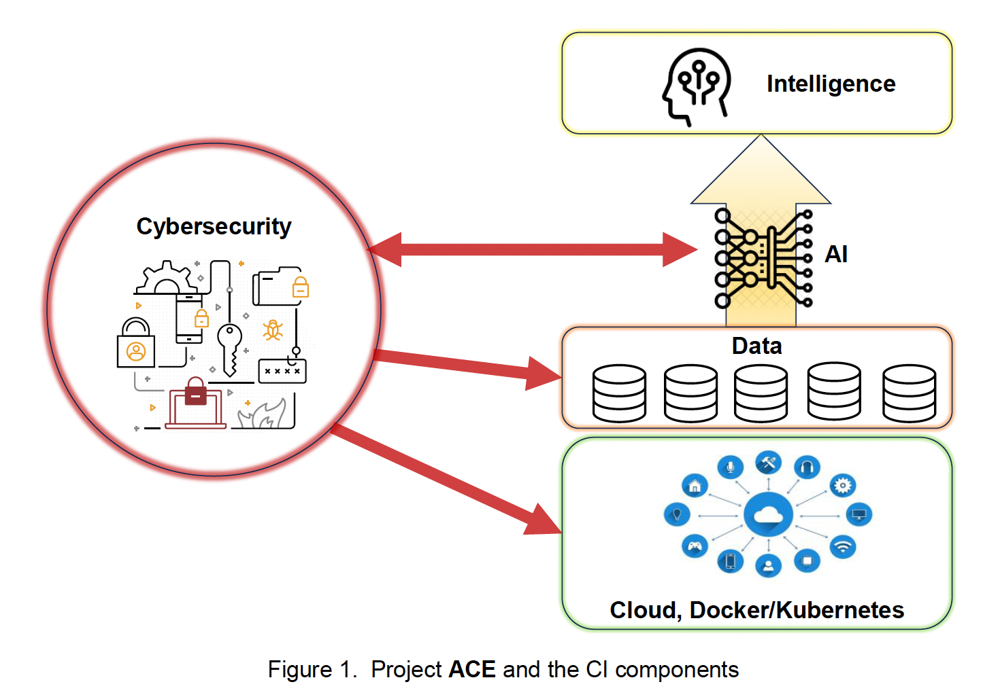

===========================================================================
AI and Cybersecurity Education for CyberInfrastructure: A Hands-on Approach
===========================================================================

.. toctree::
    :hidden:
    :maxdepth: 2
    :caption: Know the team

    intro/purdue_team
    intro/tuskegee_team

Introduction:
=============
CyberInfrastructure (CI) plays a vital role in today's scientific landscape.
Investments in CI bring significant economic benefits across various sectors.
However, the field faces three critical challenges: a lack of skilled professionals,
especially in combining cybersecurity and machine learning; limited opportunities for
underrepresented minorities; and education falling behind the fast pace of technological
advancements like AI and large language models. Project ACE (Advancing CyberInfrastructure Education)
aims to address these challenges by providing comprehensive education and training to build a more
robust CI workforce. This effort will enhance defenses against cyberattacks, drive technological progress,
and support the resilience and advancement of digital economies and scientific research.

Project ACE's innovative approaches are highlighted in three key areas.
First, it integrates Machine Learning (ML) and Cybersecurity within CyberInfrastructure (CI) frameworks,
training students on secure design principles and advanced ML techniques to tackle modern cyber threats.
Second, it incorporates advanced Artificial Intelligence (AI), particularly Large Language Models (LLM),
and experiential learning to bridge the gap between theory and practice, preparing students to apply AI
creatively in various CI contexts. Lastly, it lays the groundwork for future CI workforce development
through a scalable and adaptable educational framework that meets current technological needs and adapts
to future advancements. The project's success will enhance the security and resilience of CyberInfrastructure (CI)
across various sectors by democratizing access to CI resources and education, particularly for underrepresented
groups, including those at Historically Black Colleges and Universities (HBCUs). Furthermore, a cooperative
network of educators, industry experts, and policymakers will foster the growth of a dynamic and innovative
CI workforce ecosystem.

This award reflects NSF's statutory mission and has been deemed worthy of support through evaluation
using the Foundation's intellectual merit and broader impacts review criteria.

Motivation:
===========
The advance of scientific research is increasingly reliant on CyberInfrastructure.
This has underscored the need for a robust workforce capable of navigating and leveraging
this digital landscape. The drive to foster workforce development in the field of CyberInfrastructure
is influenced by a variety of factors and rooted in the evolving demands of scientific research.
One of the primary drivers is the escalating threat of cybersecurity. As research becomes more
data-intensive and interconnected, it also becomes more vulnerable to cyber threats. These threats can
compromise the integrity of research data and infringe upon the privacy of individuals. Therefore,
there is a pressing need for professionals who are well-versed in the principles and practices of cybersecurity.
These individuals play a crucial role in safeguarding CyberInfrastructure and ensuring that it remains a reliable
and secure platform for scientific research.
Another significant motivator is the advent of machine learning technologies. Machine learning, with its ability
to extract insights from large datasets, holds immense potential for advancing scientific research. However,
harnessing this potential requires a workforce that understands not only the theoretical underpinnings of machine
learning algorithms but also their practical application in a CyberInfrastructure context.
Project ACE is strategically structured to augment the CyberInfrastructure workforce through the dissemination
of pivotal knowledge and competencies. Shown in Figure 1, the curriculum of project ACE covers traditional
CyberInfrastructure elements: cloud computing, Docker/Kubernetes, and data management. Moreover, the program
extends its educational scope to incorporate advancements in AI and cybersecurity. Specifically, the project
teaches learners the application of cybersecurity measures in safeguarding cloud computing environments,
data management systems, and AI models.Additionally, the project emphasizes the integration of AI methodologies
to bolster cybersecurity frameworks.

Challenges:
===========

The field of CyberInfrastructure is currently facing the following three significant challenges.

Challenge 1: Workforce Woes
--------------------------------
Despite the increasing demand for professionals in this area, there is a noticeable lag in the development of
a skilled workforce. This lag is particularly evident in the areas of cybersecurity and machine learning,
which are critical components of modern CyberInfrastructure.

Challenge 2: Tech’s Lost Tribe
-----------------------------------
Furthermore, underrepresented minorities, including Black, Latino, and Indigenous people, are not adequately
benefiting from opportunities in this field. They remain underrepresented in computing jobs, with Black and
Hispanic people making up almost 13% and 18% of the US workforce, but holding only 7% and 8% of the jobs in
computing. This under representation is a result of various factors, including the lack of early exposure to
engineering majors and the absence of supportive and inclusive environments.

Challenge 3: Training Trails Tech
--------------------------------------
Research and development in CyberInfrastructure, despite its critical role in underpinning modern
technological advancements, is often observed to lag behind the rapid evolution of areas such as cybersecurity,
artificial intelligence (AI), and large language models (LLMs). This gap is attributed to various factors
including funding constraints, the fast-paced nature of technological innovation, and the complexity of
integrating new technologies into existing infrastructures. Notably, scholars point out that while advancements
in AI and LLMs, such as described in the groundbreaking GPT-3 paper, propel forward at an unprecedented rate,
the underlying CyberInfrastructure often struggles to keep pace in terms of security, scalability, and
interoperability. Similarly, cybersecurity, a field that is rapidly evolving in response to increasing
cyber threats, often finds its advancements inadequate to protect CyberInfrastructure. These disparities
underscore the need for a more synchronized and proactive approach in the development of CyberInfrastructure
to adequately support and leverage contemporary technological innovations.