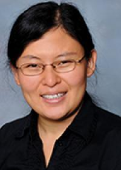

Purdue University
=================

Dr. Baijian Yang
----------------

Dr. Yang is a Professor of Computer and Information Technology at Purdue University and the Associate Dean for Research
of Purdue Polytechnic Institute. He is an expert in CyberInfrastructure, cybersecurity, and machine learning. He has
crafted practical teaching materials through NSF-funded CHEESEhub project. Additionally, he has created and taught the
"Design for Security" course five times, benefiting over 100 industry partners. Dr. Yang has also
developed the FileTSAR and FileTSAR+ projects for the National Institute of Justice (NIJ), focusing on developing
open-source
software tools for restoring files from network captures.

Dr. Deepak Nadig
----------------

Dr. Nadig is an Assistant Professor of Computer and Information Technology. He has extensive experience developing novel
and at-scale solutions and architectures for cloud-native infrastructure, data-intensive science, software-defined
networking (SDN), and virtualized networks. He has developed graduate and undergraduate courses on cloud-native
infrastructure, network virtualization and cloud, data center and carrier networks.

Dr. Jin Wei-Kocsis
------------------

Dr. Wei-Kocsis is an Associate Professor of Computer and Information Technology at Purdue University.
She has extensive research and educational experience in machine learning (ML) and deep learning (DL).
She has developed and taught one undergraduate course, Applied Machine Learning, and one graduate course,
Deep Learning for Cyber Security and Privacy.

Dr. Tonglin Zhang
-----------------

Dr. Zhang is an Associate Professor in Statistics Department at Purdue University. He is a renowned statistician in
Computational Statistics, Spatial analysis, Big Data, and Artificial Intelligence.
He has developed innovative big data approaches and taught statistic courses for students majored in Data Science

Dr. Loran Carleton Parker
-------------------------

Dr. Loran Carleton Parker is Associate Director and principal scholar of the ELRC. **She will lead ELRC’s independent
evaluation review for the ACE project**. Dr. Parker has more than 17 years of experience in evaluation of education,
training, and development initiatives. She holds a PhD in Science Education and has deep expertise in design and
evaluation of STEM education programs. Her collaborative research and evaluation work has been published in over 25
peer review journals. Dr. Parker chaired the research and evaluation strand of NIH’s Science Education Partnership
Award annual meeting for 2020-2022.

