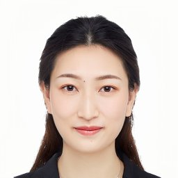

Tuskegee University
===================

Dr. Fan Wu
----------

.. image:: ../../images/Prof_Fan_Wu.png
    :alt: Pic of Dr. Fan Wu
    :align: center
    :height: 250
    :width:  200

Dr. Fan Wu is a Professor and Head of Computer Science, the
director of Tuskegee University’s Office of Undergraduate Research, and the director of National Center of Information
Assurance Education at TU. His teaching and research interests lie in primarily in Cybersecurity, Data Science, Machine
Learning, Mobile Security, High Performance Computing and Artificial Intelligence. He leads several projects funded by
NSF, NSA, DHS, DoD, NIH, NASA, and NOAA. He has involved students into research and published several research papers
on data science, machine learning, and cybersecurity.

Dr. Mohammad Rahman
-------------------

Dr. Rahman is an Assistant Professor of Computer Science at Tuskegee University. His research focuses on artificial
intelligence, quantum computing, cloud security, and data science. He has developed and taught a broad range of
computer science courses at Tuskegee.

Dr. Baiyun Chen
---------------

Dr. Chen is an Assistant Professor of Computer Science at Tuskegee University. Her research focuses on artificial
intelligence and machine learning. She has developed and taught artificial intelligence and machine learning courses
at Tuskegee.